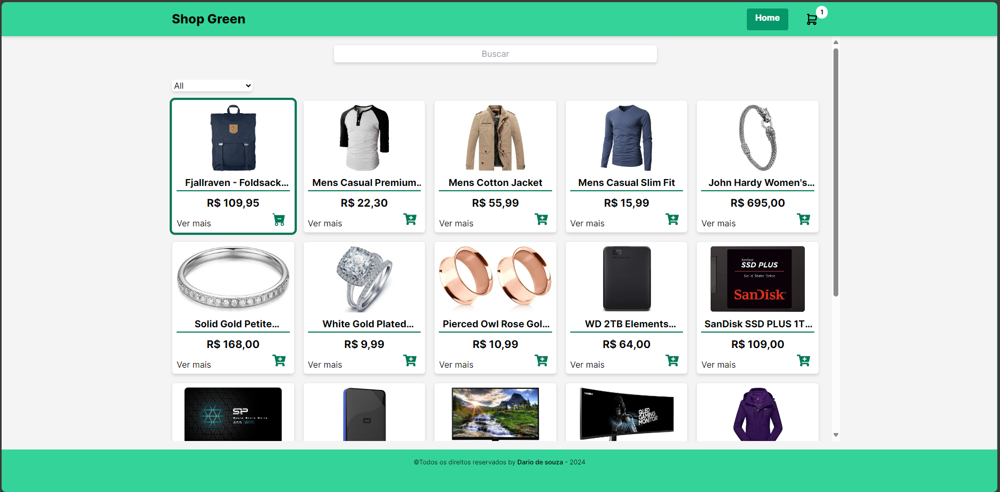
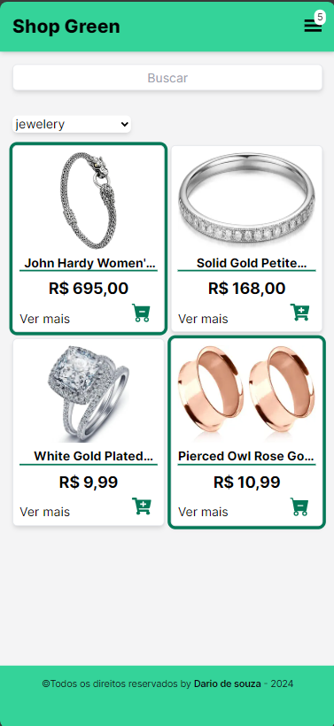

## Shop Green 🛒
### Descrição
Este é um protótipo de um e-commerce, tendo as principais funcionalidades de uma loja virtual onde podemos:  
- Adicionar itens ao carrinho
- Remover os itens
- Ver detalhes
- Finalizar compra
- Ver saldo
- Quantidade de itens

## Link do projeto
<a href="https://shop-green-two.vercel.app/" target="_blank">Shop-Green</a>
## Funcionamento
Você pode clicar no ícone do carrinho para adicionar um produto, esse ícone terá uma uma aparência diferente, com um sinal de "-" e o item será adicionado ao carrinho, você verá um contador ao lado ícone de carrinho(tamanho de tela desktop, se for em telas menores(mobile) o contador de itens ficará no menu hamburguer) indicando a quantidade de itens do carrinho. Para remover o item do carrinho, basta clica novamente no icone do carrinho na tela de produtos. 
É possivel remover os itens do carrinho tanto na página home quanto na página de detalhes do produto ou na página do próprio carrinho.

## Lógica de fluxo de dados
Ao abrir o site, os dados são carregados na primeira renderização da página e armazenados em cache do navagador, evitando requisições desnecessárias ao servidor, claro, importante ressaltar que é apenas um exemplo de otimização, nesse projeto não havia essa necessidade, mas em um caso real, um e-commerce recebe um fluxo maior de requisições. Esses dados são obtidos via API => https://fakestoreapi.com/products.  
O gerenciamento do carrinho é feito pelo localstorage do navegador, sendo assim, o usuário pode dar refresh na página e não perderá os itens adicionados.

## Rotas da aplicação
```
base_url => https://fakestoreapi.com/products  
/products  
/products/{id}  
/products/categories  
/products/category/{category}
```
## Fakestore API Docs
[DOCS](https://fakestoreapi.com/docs)

## Instalação

```bash
npm run dev
# or
yarn dev
# or
pnpm dev
# or
bun dev
```
Servidor vai rodar no localhost:3000  

### Tecnologias utilizadas
[](https://skillicons.dev)  

### Prints



 


## Deploy na Vercel

The easiest way to deploy your Next.js app is to use the [Vercel Platform](https://vercel.com/new?utm_medium=default-template&filter=next.js&utm_source=create-next-app&utm_campaign=create-next-app-readme) from the creators of Next.js.

Check out our [Next.js deployment documentation](https://nextjs.org/docs/deployment) for more details.
